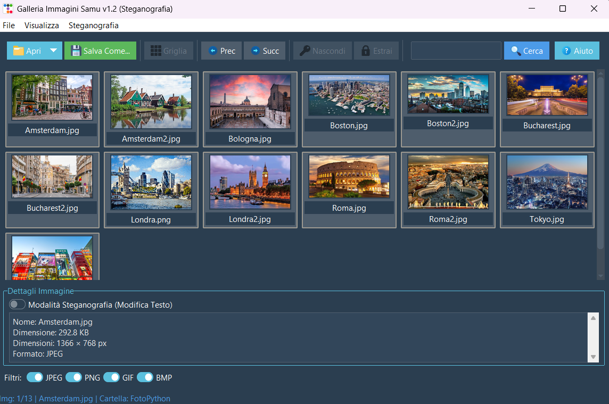

# 🖼️ Galleria Immagini con Steganografia - Project Work DevOps 2025

    

Benvenuto nel mio progetto GitHub! 🎉 Questa galleria interattiva di immagini non è solo un archivio visivo, ma un viaggio nel misterioso mondo della steganografia, una tecnica che permette di celare messaggi segreti all’interno di semplici immagini.

La steganografia è un’arte antica. Dai messaggi nascosti dagli antichi Greci sotto strati di cera ai codici invisibili usati nella Seconda Guerra Mondiale, questa tecnica è sempre stata un metodo ingegnoso per comunicare senza destare sospetti. Oggi, nel mondo digitale, possiamo sfruttare la potenza delle immagini per trasmettere informazioni invisibili, ma leggibili solo a chi conosce il segreto.

✨ Funzionalità Principali
🔹 Esplora le immagini in modalità griglia o presentazione 
🔹 Ricerca dinamica per trovare rapidamente i file 
🔹 Filtri avanzati per selezionare formato e caratteristiche 
🔹 Steganografia interattiva:

✨ Nascondi un messaggio in un'immagine (solo PNG)

🔎 Estrai un messaggio segreto da un'immagine

🔹 Interfaccia elegante con ttkbootstrap e supporto modalità scura 
🔹 Navigazione intuitiva con scorciatoie da tastiera (← e →)

🎨 Anteprima dell'Interfaccia

> Un'interfaccia pulita e intuitiva basata su Tkinter + ttkbootstrap, perfetta per esplorare il mondo nascosto della steganografia.

🛠️ Tecnologie Utilizzate
🔹 Python 3.x 
🔹 Tkinter + ttkbootstrap (GUI moderna e responsiva) 
🔹 Pillow (gestione immagini) 
🔹 stegano (steganografia LSB)

🚀 Avvia il Progetto e Diventa un Maestro della Steganografia
## 🔧 Requisiti
Assicurati di avere Python 3 installato. Ti consiglio di creare un ambiente virtuale per evitare conflitti tra pacchetti:
```bash
# Creazione di un ambiente virtuale
python -m venv venv
source venv/bin/activate  # macOS/Linux
venv\Scripts\activate  # Windows

# Ora installa le dipendenze necessarie:
pip install -r requirements.txt
```
```bash
# Avvio dell'applicazione
python main.py
```
🕵️ Come Funziona la Steganografia?
Nel mondo digitale, nascondere un segreto è più semplice di quanto sembri. La steganografia non modifica visibilmente un’immagine, ma inserisce informazioni nei pixel usando tecniche avanzate.

💡 Esempio pratico in Python:
```python
from stegano import lsb

# Nascondere un messaggio segreto
lsb.hide("input.png", "Messaggio segreto").save("output.png")

# Estrarre il messaggio nascosto
hidden_message = lsb.reveal("output.png")
print("Messaggio estratto:", hidden_message)
```
🔗 Contribuisci e Espandi il Mistero
💡 Vuoi migliorare il progetto? Apri una Issue o una Pull Request su GitHub! 📜 Licenza: MIT – Libero di esplorare, migliorare e condividere.

👨‍💻 **Creato da:** [Samuele](https://github.com/H1R05)  

✨ Se ti è piaciuto il progetto, lascia una ⭐ su GitHub! 🕵️‍♂️